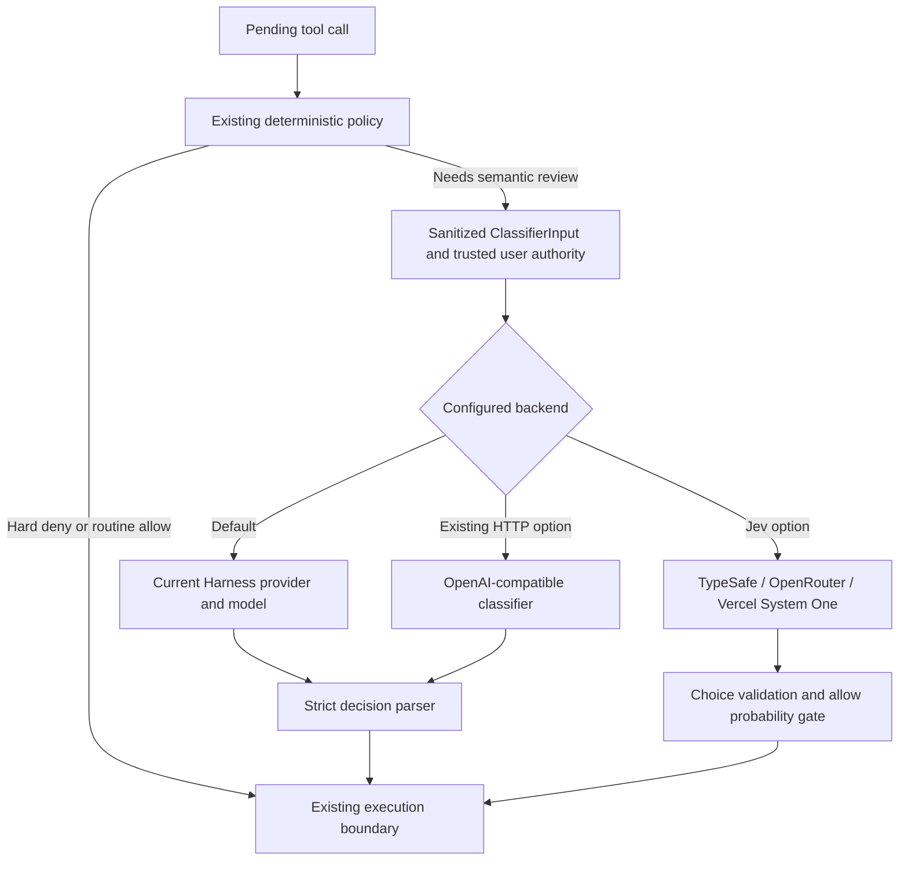

# Jev permission classifier

Auto still uses the current Harness session's provider/model by default. Jev is an optional independent security classifier; it does not replace the coding agent, deterministic hard denials, sandbox, trusted-user extraction, payload sanitization, or failure recovery.



## Install this experimental branch

[中文安装与配置指南](jev-quickstart.zh-CN.md)

These changes are on `experiment/jev-provider`, not the published npm package. Jev real-API acceptance used Harness **0.1.5-rc.1**; the base plugin's older compatibility matrix is not additional Jev runtime evidence. Keep your existing coding-model account configured.

```sh
dsh --version
git clone --branch experiment/jev-provider --single-branch https://github.com/NanmiCoder/dsh-auto-mode.git dsh-auto-mode-jev
cd dsh-auto-mode-jev
pnpm install --frozen-lockfile
pnpm build
dsh plugin --profile web add .
```

The local install links to this checkout: keep it available and rebuild after changing source. Use a Node version allowed by `package.json` and pnpm (tested with pnpm 10.33.0). Do not mix Harness split-package versions.

Save the configuration below to a separate file such as `$HOME/.dsh/jev-trial.yml`. Supply the provider key in the shell environment, then launch the same profile with the overlay:

```sh
dsh --profile web --patch "$HOME/.dsh/jev-trial.yml" --dump-config
dsh --profile web --patch "$HOME/.dsh/jev-trial.yml"
```

The dump should contain `auto-permission-mode` with the selected backend/provider. In the Web UI select **Auto** and acknowledge its notice. The default coding-model provider remains necessary: Jev only judges eligible permissions. Routine calls can be allowed by local rules and need not make a Jev request.

To revert a separate overlay, stop that process and restart `dsh --profile web` without `--patch`. If you edited a permanent profile, remove all Jev-specific fields and any Jev endpoint/model/key overrides, or replace that row with `classifierBackend: harness`. Do not leave `jevProvider` on a Harness backend.

## Configure

Add this row to a trusted profile's `cordis.patch.yml` (or a CLI `--patch` file):

```yaml
- id: auto-permission-mode
  config:
    classifierBackend: jev
    jevProvider: typesafe
    classifierTimeoutMs: 30000
    jevMinAllowProbability: 0.9
```

Set the matching environment variable in the **Harness process environment**, then restart the profile. Never put keys in version-controlled YAML.

| `jevProvider` | Default environment variable | Default model | Endpoint |
| --- | --- | --- | --- |
| `typesafe` | `TYPESAFE_API_KEY` | `jev-latest` | `https://api.typesafe.ai/v1/systemone` |
| `openrouter` | `OPENROUTER_API_KEY` | `typesafe/jev-1.13` | `https://openrouter.ai/api/v1/systemone` |
| `vercel` | `AI_GATEWAY_API_KEY` | `typesafe-ai/jev` | `https://ai-gateway.vercel.sh/typesafe/v1/systemone` |

`classifierApiKeyEnv` overrides the environment variable **name**. `classifierModel` overrides the model ID. `classifierEndpoint` overrides the complete endpoint (HTTPS, or loopback HTTP for tests; no URL credentials/query/fragment). Use an explicit key variable when configuring a private gateway. Redirects are rejected. Missing keys and invalid settings prevent classifier activation; they never select a different provider silently.

`classifierProvider` remains reserved for a Harness route and must not accompany Jev configuration. To return to the default, remove the Jev fields or set `classifierBackend: harness`. Existing `classifierEndpoint` configurations still select the original OpenAI-compatible HTTP classifier when `classifierBackend` is omitted; `classifierBackend: http` makes that choice explicit. There is no automatic environment-variable switch that could silently change the default provider.

## Decisions and failures

All transports use the same policy. Jev receives one Choice question (`allow`, `ask`, `deny`) and the same bounded, sanitized permission facts as the native classifier. It never receives benchmark labels or full transcripts. It does not produce natural-language explanations: the returned reason is explicitly marked as a **host summary**.

The adapter checks the answer type, label, finite probabilities, distribution sum, selected maximum, confidence and response size. Live providers round the three probabilities to two decimals, so total drift up to 0.015 is tolerated. The allow gate uses `selected / max(1, sum)`: excess mass lowers the probability, while missing mass never inflates it. An `allow` probability below `jevMinAllowProbability` becomes `ask`. The default 0.9 is a conservative starting threshold, **not a calibrated assurance of safety**, nor a bound on the provider's unrounded probabilities. Probability and confidence are different; confidence is validated but is not substituted for probability. Native Harness decisions remain unchanged.

Malformed answers, transport errors, rate limits and timeouts enter the existing fail-closed recovery (deny, then manual approval after repeated failures). There are no hidden network retries or fallbacks to the coding model. A valid allow answer below the probability threshold becomes manual review; this is not a transport failure. Static hard denials never reach Jev.

## Provider validation and troubleshooting

| Provider | Verification status |
| --- | --- |
| Official TypeSafe | Real API comparison and actual Harness feature acceptance passed on 0.1.5-rc.1 |
| OpenRouter | Real API comparison using the packaged adapter in the actual Harness entry passed |
| Vercel | Adapter implemented; this account returned HTTP 403 requiring billing verification, so no live-inference success claim |

Missing-key errors mean the process has not inherited the selected environment variable. Restart Harness from the shell where it is set. HTTP 401/403 requires checking provider/account access; provider failures do not silently switch to another model. More `ask` decisions can be expected with the 0.90 gate; lowering it is an unvalidated safety trade-off, not a guaranteed fix.

Avoid combining `classifierProvider` from a native-route example with a Jev config. Use `jevProvider` instead. Check the branch checkout and rebuild if the configuration fields are unknown. The package version remains 0.1.9 during this experiment; version text alone cannot distinguish the branch build from the published package.

## Evidence and benchmark

The [expanded 2026-09-26 experiment](jev-docker-benchmark-2026-09-26.md) compares only official Jev and DeepSeek Flash: 200 cases, five rounds, 2,000 measured calls with Docker effects verification. It includes raw Choice versus thresholded decisions, repeat stability, legacy/new cohorts, and a separate shell-only breakdown.

See the [Docker business replay results](jev-docker-benchmark-2026-09-21.md) and [Docker reproduction method](../benchmarks/docker-permission/README.md) for the earlier three-route experiment. The complete 60-case suite measured 95.00% / 77.22% / 76.67% final-decision accuracy for DeepSeek / official Jev / OpenRouter Jev. Official Jev reduced latency but escalated many explicitly authorized operations. All three allowed the hidden destructive script when script contents were unavailable. These are adapter-and-policy results, not general model accuracy or autonomous-agent task success.

See the [benchmark protocol](jev-benchmark-protocol.md) and [dated benchmark report](jev-benchmark-2026-09-20.md) for actual measurements and unverified boundaries. The runner and cases live in the source repository under `benchmarks/permission`; they are not runtime package files. Endpoint implementation support is distinct from an account successfully serving requests.

Official API references verified on 2026-09-20:

- [TypeSafe HTTP API](https://docs.typesafe.ai/api): `/v1/systemone`, Choice answers and probabilities. This account's `/v1/models` exposed `jev-latest` and `jev-preview`; `jev-1.13` was rejected, so the official default follows the documented alias.
- [OpenRouter TypeSafe SDK compatibility](https://openrouter.ai/docs/guides/community/typesafe-sdk): current `/api/v1/systemone` endpoint and bare/prefixed model mappings. The earlier `jev-arena` implementation used `/api/alpha/decisions`.
- [Vercel TypeSafe-compatible API](https://vercel.com/docs/ai-gateway/sdks-and-apis/typesafe): `/typesafe/v1/systemone`, Gateway authentication and model ID. No AI SDK dependency is required.

The external reference project `NanmiCoder/jev-arena` informed the transport investigation; the permission policy and adapter are implemented here for the existing `SafetyClassifier` interface.
